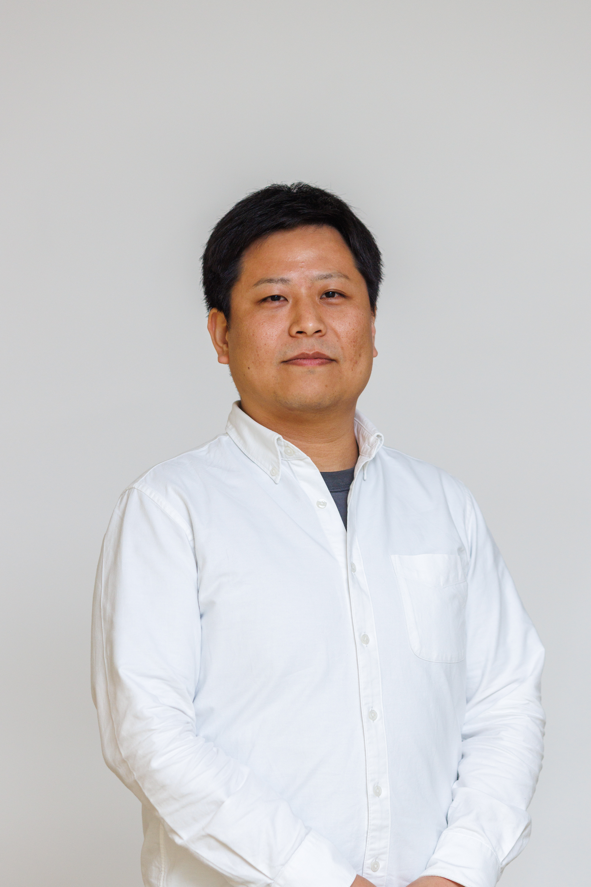

# 研究概要 {#about}

## 中心的研究テーマ：長寿と百寿者研究

当研究グループは、スウェーデンの**百寿者（100歳以上の高齢者）**を対象とした包括的な全国規模の人口研究を通じて、人々がどのようにして長寿を達成するかという根本的な問いに取り組んでいます。主な研究テーマは以下の通りです：

**疾患の軌跡と健康レジリエンス**

-   百寿者は疾患を生き延びて、遅らせて、または回避して100歳に到達するのか
-   生涯にわたる疾患蓄積パターンと多疾患併存
-   自立した百寿者と要介護百寿者の健康軌跡の比較
-   「疾病圧縮」の概念と恒常性維持能力

**長寿のバイオマーカー**

-   百寿者と短命者を区別する血液バイオマーカープロファイル
-   35年間の追跡調査を行ったスウェーデンAMORISコホートの活用
-   100歳到達に関連する生物学的特徴の特定

**ケアニーズと生活環境**

-   スウェーデン百寿者全体の記述
-   医療利用パターン、多剤併用、長期介護依存度
-   在宅で自立生活を送る百寿者と公的介護を必要とする百寿者の比較

# メンバー {#member}

## 村田 峻輔
::: {style="display: grid; grid-template-columns: 120px 1fr; gap: 15px; align-items: start;"}
::: {}
{width=120px}
:::

::: {}
Assistant professor  
Tohoku University  
Frontier Research Institute for Interdisciplinary Sciences  
[E-mail](mailto:shunsuke.murata@ki.se)
:::
:::
[{width=150px}](https://researchmap.jp/muratas?lang=en){target="_blank"}  &nbsp;&nbsp; [{width=150px}](https://scholar.google.com/citations?user=UgbhvSsAAAAJ&hl=en){target="_blank"} &nbsp;&nbsp; [{width=30px}](https://orcid.org/0000-0002-1670-020X){target="_blank"} &nbsp;&nbsp; [{width=30px}](https://www.linkedin.com/in/shunsuke-murata-6631141a6/){target="_blank"}

# 募集 {#hiring}

## 日本学術振興会（JSPS）特別研究員制度

当研究室では、**日本学術振興会（JSPS）特別研究員制度**を通じた研究員の募集を行っています。

JSPS特別研究員制度は、優秀な研究者が日本の研究機関で研究を行うことを支援する、わが国を代表する競争的研究資金制度です。

**主な特徴：**
- 生活費に充当する競争的な月額奨励金
- 研究活動を支援する研究費

詳細な応募資格、申請手続き、応募期限については、日本学術振興会の公式ウェブサイトをご覧ください：

[**日本学術振興会 特別研究員制度（PD）公式ページ**](https://www.jsps.go.jp/j-pd/){target="_blank"}

応募にご興味がある場合や研究機会についてご相談したい場合は、以下までお問い合わせください：[shunsuke.murata@ki.se](mailto:shunsuke.murata@ki.se)

# 研究業績 {#publications} 

```{r}
#| echo: false
#| message: false
#| warning: false
#| results: asis

# Install packages if needed
library(httr)
library(jsonlite)

# Function to check if name contains Japanese characters
is_japanese <- function(name) {
  grepl("[\u3040-\u309F\u30A0-\u30FF\u4E00-\u9FFF]", name)
}

# Function to convert "Firstname Middlename Lastname" to "Lastname FM"
format_author_name <- function(name) {
  # Remove extra whitespace
  name <- trimws(name)
  
  # If Japanese name, return as is
  if (is_japanese(name)) {
    return(name)
  }
  
  # Split the name by space
  parts <- strsplit(name, "\\s+")[[1]]
  
  if (length(parts) >= 2) {
    # Last part is surname, everything else is given/middle names
    surname <- parts[length(parts)]
    given_names <- parts[1:(length(parts)-1)]
    
    # Get initials from all given/middle names
    initials <- paste(substr(given_names, 1, 1), collapse = "")
    
    return(paste0(surname, " ", initials))
  } else {
    # If only one part, return as is
    return(name)
  }
}

# Fetch data from researchmap
url <- "https://api.researchmap.jp/muratas/published_papers"
response <- GET(url)
data <- fromJSON(content(response, "text", encoding = "UTF-8"))

# Get publications
pubs <- data$items

# Sort by year
pubs <- pubs[order(-as.integer(substr(pubs$publication_date, 1, 4)), na.last = TRUE), ]

# Get unique years
years <- unique(as.integer(substr(pubs$publication_date, 1, 4)))
years <- sort(years[!is.na(years)], decreasing = TRUE)

# Display each year
for (year in years) {
  # cat("\n## **", year, "年**\n\n", sep = "")
  
  year_pubs <- pubs[as.integer(substr(pubs$publication_date, 1, 4)) == year, ]
  
  for (i in 1:nrow(year_pubs)) {
    pub <- year_pubs[i, ]
    
    # Title (Japanese first, then English)
    title <- pub$paper_title$ja
    if (is.na(title) || is.null(title)) title <- pub$paper_title$en
    if (is.na(title) || is.null(title)) title <- "タイトルなし"
    
    # Authors - more robust handling
    authors <- NULL
    if (!is.null(pub$authors$ja[[1]])) {
      authors <- pub$authors$ja[[1]]
    } else if (!is.null(pub$authors$en[[1]])) {
      authors <- pub$authors$en[[1]]$name
    }
    
    # Ensure authors is a character vector
    if (!is.null(authors) && length(authors) > 0) {
      authors <- as.character(unlist(authors))
      # Format each author name (only English names)
      authors <- sapply(authors, format_author_name, USE.NAMES = FALSE)
      author_text <- paste(authors, collapse = ", ")
    } else {
      author_text <- "著者不明"
    }
    
    # Make your name bold (handle both Japanese and English versions)
    author_text <- gsub("村田 峻輔", "**村田 峻輔**", author_text)
    author_text <- gsub("Murata S", "**Murata S**", author_text)
    
    # Create citation parts
    journal <- ifelse(is.na(pub$publication_name$en) || is.null(pub$publication_name$en), 
                      "", pub$publication_name$en)
    
    # Volume/issue/pages (handle NAs)
    vol_info <- ""
    if (!is.na(pub$volume) && !is.null(pub$volume)) vol_info <- pub$volume
    if (!is.na(pub$number) && !is.null(pub$number)) vol_info <- paste0(vol_info, "(", pub$number, ")")
    if (!is.na(pub$starting_page) && !is.null(pub$starting_page)) {
      pages <- pub$starting_page
      if (!is.na(pub$ending_page) && !is.null(pub$ending_page)) {
        pages <- paste0(pages, "-", pub$ending_page)
      }
      vol_info <- paste0(year, ";", vol_info, ":", pages)
    }
    
    # DOI with hyperlink
    doi_text <- ""
    if (!is.null(pub$identifiers$doi[[1]]) && length(pub$identifiers$doi[[1]]) > 0) {
      doi_url <- paste0("https://doi.org/", pub$identifiers$doi[[1]][1])
      doi_text <- paste0("[", doi_url, "](", doi_url, "){target='_blank'}")
    }
    
    # Output citation with HTML line breaks
    cat(i, ". ", title, "<br>\n", sep = "")
    cat(author_text, "<br>\n", sep = "")
    if (journal != "") {
      cat("*", journal, "*", sep = "")
      if (vol_info != "") cat(", ", vol_info, sep = "")
      cat("<br>\n")
    }
    if (doi_text != "") cat(doi_text, "<br>\n", sep = "")
    cat("\n")
  }
}
```


# 研究費 {#funding}

(@)  スウェーデンと日本の高齢者・介護状況の比較：医療・介護データを用いた検証 
海外特別研究員, 日本学術振興会, Feb, 2024

(@)  がんサバイバーの循環器疾患：がん特異的危険因子解明とリハビリテーション効果検証 
科学研究費助成事業, 特別研究員奨励費, 日本学術振興会, Apr, 2020 - Mar, 2023

(@)  在宅認知症高齢者におけるリハビリテーションを含む介護サービス利用の長期的効果検証 
科学研究費助成事業, 若手研究, 日本学術振興会, Apr, 2020 - Mar, 2023

(@)  認知症患者における行方不明発生や行方不明による死亡の関連因子探索 探索的エコロジカル研究 
公益財団法人 大阪ガスグループ福祉財団, Apr, 2020 - Mar, 2021

(@)  がんサバイバーにおける心血管疾患：実態調査及びリハビリテーション効果検証 
科学研究費助成事業, 研究活動スタート支援, 日本学術振興会, Aug, 2019 - Mar, 2020

(@)  高齢者の運動器慢性痛へのより有効な非薬物療法開発 
特別研究員奨励費, 日本学術振興会, Apr, 2017 - Mar, 2019

(@)  地域在住高齢者における身体活動と骨格筋系の慢性痛の関係−座業時間、活動強度、歩行活動の個別の検討− 
公益財団法人 大阪ガスグループ福祉財団, Apr, 2017 - Mar, 2018